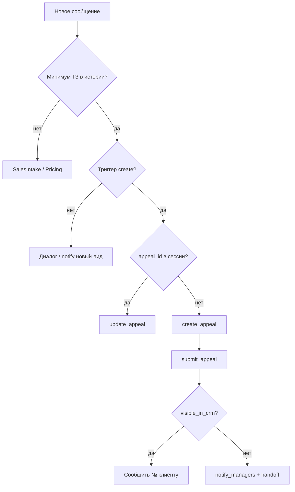

# CRMSkill — Обращения в Контакт-центр Saby

## Куда попадает обращение

**Раздел:** [Контакт-центр → Обращения](https://online.sbis.ru/page/support-service)

Именно сюда менеджеры видят входящие заявки от агента (кнопка «+» → документ «Обращение» в UI).

**Важно:** `create_appeal` только **создаёт черновик** («Ожидается отправка»). В Контакт-центре **не видно**, пока не выполнен **`submit_appeal`**.

**Общая очередь (рекомендуется):** `SBIS_DEPARTMENT_NAME` или `SBIS_DEPARTMENT_ID` + `SBIS_RECIPIENT_MODE=auto` — обращения видят все менеджеры подразделения.

**Один менеджер:** `SBIS_MANAGER_ID` + `SBIS_RECIPIENT_MODE=manager`.

При `SBIS_AUTO_SUBMIT=true` отправка сразу после `create_appeal`. Подробно: `scripts/sbis-recipients.md`.

Проверка черновиков: `python workspace/scripts/sbis_api.py list_appeals '{}'`

**Не использовать:** `CRMLead.insertRecord` — это сделки CRM, не обращения.

## API

| Шаг | Метод | Endpoint |
|-----|-------|----------|
| Авторизация | `СБИС.Аутентифицировать` | `https://online.sbis.ru/auth/service/` |
| Создать обращение | `СБИС.ЗаписатьДокумент` | `https://online.sbis.ru/service/?srv=1` |
| Обновить | `СБИС.ЗаписатьДокумент` (по `Идентификатор`) | тот же |
| Прочитать | `СБИС.ПрочитатьДокумент` | тот же |

Регламент документа: **`Обращение`** (`SBIS_APPEAL_REGULATION_NAME`).

Текст заявки — в поле **`Примечание`** (в UI: «Опишите, с чем обратился клиент» + контакт, услуга, источник).

## Переменные окружения

| Переменная | Значение |
|------------|----------|
| `SBIS_LOGIN` / `SBIS_PASSWORD` | Учётка API (`ai_agent`) |
| `SBIS_API_URL` | `https://online.sbis.ru/service/?srv=1` |
| `SBIS_APPEAL_REGULATION_NAME` | `Обращение` (по умолчанию) |
| `SBIS_SUPPORT_URL` | `https://online.sbis.ru/page/support-service` |
| `SBIS_DEPARTMENT_ID` / `SBIS_DEPARTMENT_NAME` | Общая очередь (подразделение) |
| `SBIS_MANAGER_ID` | UUID сотрудника (если без общей очереди) |
| `SBIS_RECIPIENT_MODE` | `auto` (подразделение приоритетнее) / `department` / `manager` |
| `SBIS_AUTO_SUBMIT` | `true` — отправлять после create (по умолчанию) |
| `SBIS_ORG_INN` / `SBIS_ORG_KPP` | Для поиска дубликатов через список (опционально) |

## Вызов из агента (Windows / local)

**Инструмент:** `exec` (не «bash»). Рабочая директория — workspace.

```bash
python scripts/sbis_api.py create_appeal '{"name":"Иван Петров","phone":"+79001234567","source":"telegram","service_type":"Визитки","description":"100 шт, 90x50, 4+0, текст Все готово","channel_id":"telegram:123456789","session_id":"sess_abc","estimated_price":"1500 руб"}'
```

**Проверка успеха:** в JSON ответа `visible_in_crm: true` или `submit.submitted: true`.  
Если `draft: true` и `submit.skipped` — обращение **не видно** в [Контакт-центре](https://online.sbis.ru/page/support-service); нужны `SBIS_DEPARTMENT_NAME` или `SBIS_MANAGER_ID` в `.env`.

```bash
python scripts/sbis_api.py submit_appeal '{"appeal_id":"<uuid>","description":"..."}'
```

## Вызов из агента (Docker)

```bash
bash /app/workspace/scripts/sbis_crm.sh create_appeal '{
  "name": "Иван Петров",
  "phone": "+79001234567",
  "source": "telegram",
  "service_type": "Визитки",
  "description": "Нужны визитки 1000 шт, двусторонние",
  "channel_id": "telegram:123456789",
  "session_id": "sess_abc",
  "estimated_price": "от 2500 руб"
}'
```

**Ответ:** сохранить `appeal_id`, `title`, `open_url`. Если `draft: true` — вызвать `submit_appeal` с тем же JSON + `appeal_id`.

**Telegram менеджерам:** после успешного `create_appeal` ссылка и краткое ТЗ уходят автоматически на все `MANAGER_TELEGRAM_CHAT_IDS` (поле `telegram_notify` в JSON). Отключить: `SBIS_NOTIFY_MANAGERS=false` или `"notify_managers": false` в JSON.

```bash
bash /app/workspace/scripts/sbis_crm.sh submit_appeal '{
  "appeal_id": "<uuid>",
  "description": "Нужны визитки, 1000 шт"
}'
```

Проверка / повторное чтение:

```bash
bash /app/workspace/scripts/sbis_crm.sh find_appeal '{"appeal_id":"<uuid из create>"}'
```

После handoff:

```bash
bash /app/workspace/scripts/sbis_crm.sh update_appeal '{
  "id": "<appeal_id>",
  "status": "waiting_manager",
  "note": "Клиент готов к расчёту, передано менеджеру"
}'
```

## Когда создавать обращение (обязательно для агента)

Сверяйся с **AGENTS.md → Шаг 5** и этой таблицей **перед каждым** `create_appeal`.

### Минимум ТЗ (все пункты должны быть в истории чата или в текущем сообщении)

| Поле | Обязательно | Откуда |
|------|-------------|--------|
| Услуга / продукт | да | `service_type` |
| Суть заказа | да | `description` (тираж, размер, материал, срок — что есть) |
| Контакт | да | `phone` и/или `email` и/или Telegram `@username` |
| Имя | желательно | `name` |
| Источник | да | `telegram` + `channel_id` + `session_id` |

**Жёсткий запрет (AGENTS.md):** не вызывать `create_appeal`, пока не закончен сбор ТЗ — нельзя создавать на «Здравствуйте, нужны визитки» без тиража и контакта (кроме явной просьбы «оформите как есть»).

### Создавать СРАЗУ (`exec` create_appeal + submit_appeal)

Любой из триггеров — **без** повторных вопросов по уже известному:

1. Клиент просит: «создайте обращение», «в CRM», «оформите заявку», «заказ», «оформить», «я уже всё говорил / выше писал».
2. Клиент **согласился с ценой** («да», «устраивает», «ок», «заказываем») **и** в переписке есть услуга + параметры + контакт.
3. Согласованы дизайн / текст макета / финальные параметры — передача в производство.
4. **Handoff** (менеджер, нет тарифа, нестандарт) — если минимум ТЗ есть: сначала `create_appeal`, потом `notify_managers` / handoff.
5. Нерабочее время: после сбора ТЗ — `create_appeal` (черновик допустим), handoff утром.

### НЕ создавать (только диалог / расчёт / уведомление)

| Ситуация | Что делать вместо |
|----------|------------------|
| Первое сообщение, только тип услуги | SalesIntake, ≤2 вопроса |
| Есть тип + тираж, **нет** контакта | Спросить телефон/email, **не** create |
| Только ориентир цены, клиент ещё думает | Pricing + вопросы; можно `notify_managers` («новый лид»), **не** create |
| Уточнение материалов / KB | KnowledgeBase, без CRM |
| В сессии уже есть `appeal_id` | только `update_appeal`, не второй create |

### После create (в том же ходе диалога)

1. Прочитать JSON: `draft`, `visible_in_crm`, `submit.submitted`.
2. Если `draft: true` → сразу `submit_appeal` с тем же `appeal_id`.
3. `notify_managers` с `open_url` и номером (даже если submit не прошёл — менеджер откроет черновик).
4. Клиенту номер обращения — **только** при `visible_in_crm: true` или `submit.submitted: true`. Иначе: «Заявку зафиксировали, менеджер подключится» + handoff.



## Алгоритм (сохранить в боевой версии)

**Источник данных:** вся история текущей Telegram-сессии. Если клиент уже писал кол-во, размер, печать, дизайн — **не переспрашивать**, собрать в `description` из переписки.

1. Проверить таблицу «Когда создавать» выше.
2. Собрать JSON из истории (SalesIntake + Pricing).
3. Если в сессии уже есть `appeal_id` → **update_appeal**, не создавать новое.
4. Иначе → **create_appeal** → при `draft: true` сразу **submit_appeal**.
5. Сохранить `appeal_id` в память сессии.
6. Handoff менеджеру в Telegram + **update_appeal** со статусом `waiting_manager`.
7. Клиенту — «Обращение оформлено, №…» **только** если `visible_in_crm: true`. Иначе — handoff + «заявку передали, свяжемся».

## Маппинг полей UI ↔ API

| Поле в Saby (форма обращения) | Поле в API / JSON агента |
|-------------------------------|---------------------------|
| Опишите, с чем обратился клиент | `description` → `Контрагент.Описание` и `Примечание` |
| ФИО контактного лица | `name` → `Примечание` (в API черновика часто не попадает в форму) |
| Контакт для связи | `phone`, `email` → `Контрагент.Телефон` / `Email` и `Примечание` |
| Клиент (организация) | только при `link_client_company: true` + `client_inn` → `Контрагент.СвЮЛ` |
| Вид обращения | `service_type` → `Примечание`; в форме — справочник Saby |
| Ответственный | `SBIS_MANAGER_ID` на этапе submit (`Выполнить`) |

**Важно:** не передавать случайный `client_inn` (например 7707083893) — Saby подставит чужую организацию (Сбербанк). Полный текст заявки всегда в `Примечание` (`build_appeal_note`). Чтобы заполнять произвольные поля формы через API, в редакторе регламента «Обращение» нужно завести [дополнительные поля](https://saby.ru/help/integration/api/sequence/add_fields) и передавать их в `ДополнительныеПоля` по точным именам из редактора.

## Правила

1. Только **обращения** в support-service, не сделки.
2. При явной просьбе CRM или готовом ТЗ — **создавать сразу**, не откладывать.
3. **Запрещено** заново спрашивать параметры, которые клиент уже указал в этом чате.
4. В `Примечание` всегда включать `channel_id` и `session_id` для трассировки.
5. При ошибке API — продолжить диалог, повторить через 5 мин, уведомить менеджера.
